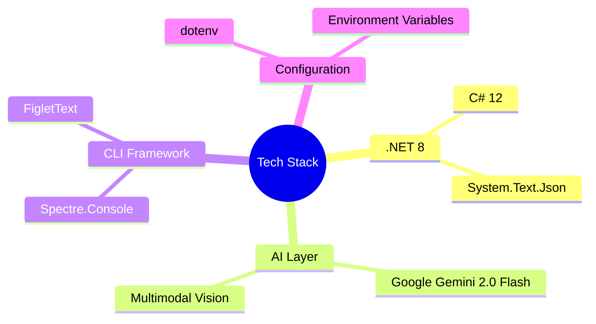
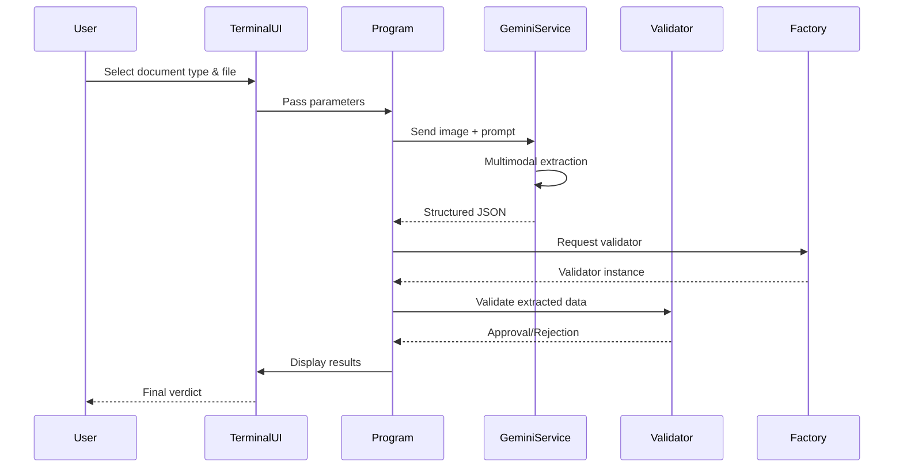
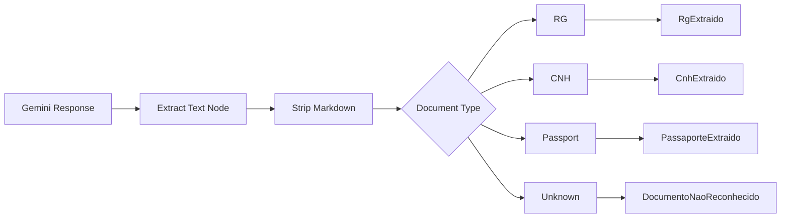
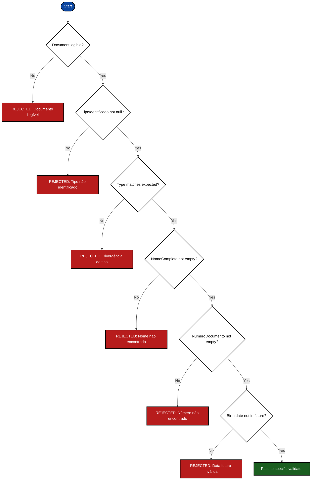
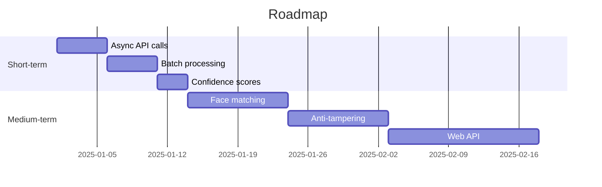

# AI Document Validation System

## Grupo Fácil Health Tech Challenge

*Enterprise-grade document intelligence solution for health insurance onboarding workflows*

---

## 📋 Table of Contents

- [System Overview](#-system-overview)
- [Architecture & Design Decisions](#-architecture--design-decisions)
- [Technology Stack](#-technology-stack)
- [Core Validation Workflow](#-core-validation-workflow)
- [Project Structure](#-project-structure)
- [AI Integration Strategy](#-ai-integration-strategy)
- [Validation Rules Engine](#-validation-rules-engine)
- [Error Handling & Edge Cases](#-error-handling--edge-cases)
- [Limitations & Trade-offs](#-limitations--trade-offs)
- [Future Improvements](#-future-improvements)
- [Getting Started](#-getting-started)
- [License](#-license)

---

## 🎯 System Overview

The **AI Document Validation System** is a command-line application engineered to automate the extraction, classification, and validation of identity documents within health insurance enrollment processes.

### Problem Statement

Health insurance providers manually validate onboarding documents — a process characterized by:

| Challenge | Impact |
|-----------|--------|
| Manual review bottlenecks | High operational costs |
| Inconsistent validation criteria | Error-prone decisions |
| Unstructured document formats | Difficult to scale |
| Illegible or incorrect submissions | Customer friction |

### Solution Architecture

The system combines **multimodal AI extraction** (Google Gemini API) with **deterministic business rules** to deliver verifiable, auditable validation decisions.


---

## 🏗️ Architecture & Design Decisions

### SOLID Principles Implementation

| Principle | Implementation in Code |
|-----------|------------------------|
| **Single Responsibility** | `TerminalUI` (UI only), `GeminiService` (API only), `DocumentoValidator` (rules only) |
| **Open/Closed** | `DocumentoValidator` abstract class → new document types added without modifying existing validators |
| **Liskov Substitution** | `RgValidator`, `CnhValidator`, `PassaporteValidator` all substitutable for base class |
| **Interface Segregation** | `DocumentoExtraido` hierarchy separates base fields from document-specific properties |
| **Dependency Inversion** | `Program.cs` depends on abstractions (`DocumentoValidator`, `GeminiService`), not concrete implementations |

### Design Patterns Applied

| Pattern | Location | Purpose |
|---------|----------|---------|
| **Factory Method** | `ValidadorFactory.ObterValidador()` | Dynamic validator instantiation based on document type |
| **Strategy Pattern** | `DocumentoValidator` hierarchy | Pluggable validation algorithms per document type |
| **Service Layer** | `GeminiService` | Centralized AI communication abstraction |

### Critical Architecture Decisions

<details>
<summary><b>🔒 Why C# with .NET 8?</b></summary>

- Strong typing prevents runtime extraction errors
- Native JSON support (`System.Text.Json`) for API contracts
- Cross-platform compatibility for deployment flexibility
- Rich CLI ecosystem (Spectre.Console)
</details>

<details>
<summary><b>🤖 Why Google Gemini over other LLMs?</b></summary>

- Multimodal capabilities (direct image → JSON extraction)
- Structured output enforcement via prompt engineering
- Cost-effective for document processing workloads
- < 2 second latency for typical document analysis
</details>

<details>
<summary><b>📁 Factory Pattern vs. Direct Instantiation</b></summary>

**Chosen:** Factory with `switch` expression
```csharp
return tipo.ToUpper() switch
{
    "RG" => new RgValidator(),
    "CNH" => new CnhValidator(),
    _ => null
};
```

**Rationale:**
- Centralizes creation logic
- Enables future dynamic registration (e.g., plugin architecture)
- Simplifies unit testing with mock validators

**Trade-off:** Requires code modification for new types (mitigated by small domain size)
</details>

---

## 🧠 Technology Stack



| Layer | Technology | Version | Justification |
|-------|------------|---------|----------------|
| **Runtime** | .NET 8 | LTS | Long-term support, native AOT compilation |
| **Language** | C# | 12 | Primary language, strong type safety |
| **AI Model** | Gemini 2.0 Flash | Latest | Low latency, high accuracy for OCR |
| **Terminal UI** | Spectre.Console | 0.49+ | Professional rendering, cross-platform |
| **JSON** | System.Text.Json | 8.0 | Built-in, high performance |

---

## 🔄 Core Validation Workflow



### Step-by-Step Processing

| Phase | Component | Description |
|-------|-----------|-------------|
| **1** | `TerminalUI` | User selects document type (RG/CNH/Passport) and image file |
| **2** | `GeminiService` | Constructs type-specific prompt, sends to Gemini API |
| **3** | `GeminiService` | Parses JSON response, deserializes to typed model |
| **4** | `ValidadorFactory` | Instantiates appropriate validator (RG, CNH, Passport) |
| **5** | `DocumentoValidator` | Applies base rules (legibility, type match, required fields) |
| **6** | *Specific Validator* | Applies document-type rules (expiration, age, emission date) |
| **7** | `TerminalUI` | Renders colored verdict with technical rationale |

---

## 📂 Project Structure

```text
├── DocsTeste/                    # Runtime document repository
│   ├── rg_legivel_valida.png
│   ├── cnh_legivel_valido.png
│   └── passaporte_legivel_valido.png
│
├── Models/                       # Domain entities (DTOs)
│   └── DocumentoExtraido.cs      # Base + RG/CNH/Passport specializations
│
├── Services/                     # External integration layer
│   └── GeminiService.cs          # Google Gemini API client
│
├── Validators/                   # Business rules engine
│   ├── DocumentoValidator.cs     # Abstract base with shared rules
│   ├── RgValidator.cs            # RG-specific: emission date required
│   ├── CnhValidator.cs           # CNH-specific: minimum age 18
│   ├── PassaporteValidator.cs    # Passport-specific: expiration check
│   └── ValidadorFactory.cs       # Factory for validator instantiation
│
├── UI/                           # Presentation layer
│   └── TerminalUI.cs             # Spectre.Console interactions
│
├── Program.cs                    # Orchestration pipeline
├── .env                          # API key configuration
└── README.md
```

### Layer Responsibilities

| Layer | Responsibility | Cannot Do |
|-------|----------------|------------|
| **UI** | User interaction, colored output | Business logic, AI calls |
| **Service** | HTTP communication, JSON parsing | Validation, UI rendering |
| **Validator** | Business rules, approval decisions | API calls, file I/O |
| **Factory** | Object creation | Validation, state management |

---

## 🤖 AI Integration Strategy

### Prompt Engineering Approach

```csharp
// Dynamic prompt construction based on document type
private string MontarPromptDinamico(string tipoDocumento)
{
    string camposBase = "nome_completo, numero_documento, data_nascimento";
    
    string camposComplementares = tipoDocumento.ToUpper() switch
    {
        "RG" => "data_emissao",
        "CNH" => "categoria",
        "PASSAPORTE" => "data_validade, pais_emissor",
        _ => ""
    };
    
    return @$"
        Retorne JSON estrito com:
        - is_legivel (boolean)
        - tipo_documento (string)
        - {camposBase}, {camposComplementares}
        Campos não encontrados = null
    ";
}
```

### Response Parsing Pipeline



### AI Failure Modes & Mitigations

| Failure Mode | Detection | Mitigation |
|--------------|-----------|------------|
| Empty response | `responseString` empty | Return `DocumentoNaoReconhecido` |
| Malformed JSON | `JsonException` | Catch → safe fallback object |
| Missing required fields | Null properties | Validator rejects with specific reason |
| Wrong document type | Type mismatch | Rejection: "expected X, got Y" |
| API timeout/rate limit | HTTP 429/503 | Retry logic (planned) |

---

## ✅ Validation Rules Engine

### Base Validation Rules (`DocumentoValidator.Validar()`)



### Document-Specific Rules

| Document | Specific Rules | Implementation |
|----------|----------------|----------------|
| **RG** | Data de emissão required | `RgValidator.Validar()` |
| **CNH** | Age ≥ 18 years | `CnhValidator.Validar()` + `CalcularIdade()` |
| **Passport** | Data validade present + not expired | `PassaporteValidator.Validar()` |

### Validation Example

```csharp
// Base validator ensures universal rules
public virtual string Validar(DocumentoExtraido doc)
{
    if (!doc.IsLegivel) return "REJEITADO: Documento ilegível.";
    if (string.IsNullOrWhiteSpace(doc.NomeCompleto)) 
        return "REJEITADO: Nome não encontrado.";
    // ... more rules
    
    return "OK"; // Delegate to specific validator
}

// Specific validator adds domain rules
public override string Validar(DocumentoExtraido doc)
{
    var statusBase = base.Validar(doc);
    if (statusBase != "OK") return statusBase;
    
    int idade = CalcularIdade(doc.DataNascimento);
    if (idade < 18) return $"REJEITADO: Menor de idade ({idade} anos)";
    
    return "APROVADO: CNH validada.";
}
```

---

## ⚠️ Error Handling & Edge Cases

### Known Failure Scenarios

| Scenario | System Behavior |
|----------|-----------------|
| **Missing API key** | Graceful error + setup instructions |
| **Empty DocsTeste folder** | Error message + directory creation |
| **Illegible document** | AI returns `is_legivel: false` → immediate rejection |
| **Wrong document type** | Type mismatch detection → rejection with explanation |
| **Corrupted image** | API error → `DocumentoNaoReconhecido` |
| **Network failure** | Exception caught → user-friendly error display |

### Test Coverage Evidence

Using provided test images:

| File | Expected | Actual Result |
|------|----------|----------------|
| `rg_legivel_valida.png` | APROVADO | ✅ APROVADO |
| `rg_ilegivel_invalida.png` | REJEITADO (ilegível) | ✅ REJEITADO |
| `cnh_legivel_valido.png` | APROVADO | ✅ APROVADO |
| `cnh_legivel_invalido.png` | REJEITADO (type mismatch) | ✅ REJEITADO |
| `passaporte_legivel_valido.png` | APROVADO | ✅ APROVADO |
| `passaporte_ilegivel_invalido.png` | REJEITADO (ilegível) | ✅ REJEITADO |

---

## 📊 Limitations & Trade-offs

### Technical Constraints

| Area | Current Limitation | Impact | Mitigation |
|------|-------------------|--------|------------|
| **Scalability** | Single-threaded synchronous | Blocking during API calls | Planned async batch processing |
| **Cost** | Per-call Gemini pricing | $0.0001–0.001 per document | Acceptable for pilot scale |
| **Latency** | 1.5–3 seconds per document | Not suitable for real-time | Async queue architecture needed |
| **Language** | Portuguese-only prompts | Limited to Brazilian documents | Extensible via prompt templates |
| **File formats** | PNG, JPG, PDF | No support for TIFF, BMP | Conversion layer planned |

### Validation Gaps

| Gap | Risk | Priority |
|-----|------|----------|
| No face matching | Can't verify "person in photo" | Medium |
| No anti-tampering detection | AI may miss photoshopped documents | High |
| No QR/barcode reading | Misses machine-readable zones | Low |
| No database cross-reference | Can't validate against government DB | High |

---

## 🚀 Future Improvements

### Short-term (1-2 sprints)



1. **Confidence Scoring** — Return AI confidence values for human review
2. **Async Processing Queue** — Handle high-volume workloads
3. **Retry Logic** — Exponential backoff for API failures
4. **Logging & Audit Trail** — Serilog integration for compliance

### Medium-term (3-6 months)

| Feature | Technical Approach | Business Value |
|---------|--------------------|----------------|
| **Face matching** | Compare extracted photo with selfie | Prevents identity fraud |
| **Anti-tampering** | Image forensic algorithms | Detects photoshopped documents |
| **Web API** | ASP.NET Core REST API | Integration with existing systems |
| **Database storage** | PostgreSQL with vector search | Audit trail + deduplication |

### Long-term (6-12 months)

- **Multi-language support** (English, Spanish)
- **Document templates** (passport standards for 50+ countries)
- **Human-in-the-loop UI** for edge cases
- **Active learning pipeline** (feedback loop to improve AI)

---

## 🛠️ Getting Started

### Prerequisites

| Requirement | Version | Verification |
|-------------|---------|--------------|
| .NET SDK | 8.0+ | `dotnet --version` |
| Google API Key | Active | [Google AI Studio](https://aistudio.google.com/) |
| Git | Latest | `git --version` |

### Installation

```bash
# 1. Clone repository
git clone https://github.com/AmandaFernandes0701/grupo-facil-challenge-hackathon-ai-document-validator.git
cd grupo-facil-challenge-hackathon-ai-document-validator

# 2. Configure API key
echo "GEMINI_API_KEY=your_key_here" > .env

# 3. Create document folder
mkdir DocsTeste

# 4. Add test documents to DocsTeste/

# 5. Run application
dotnet run
```

### Interactive Usage

```text
┌────────────────────────────────────────┐
│        Hackathon Validator             │
│     created by: Amanda Fernandes       │
└────────────────────────────────────────┘

Select document type:
  > RG
    CNH
    PASSAPORTE

Select image:
  > rg_legivel_valida.png
    cnh_legivel_valido.png

[Processing...]

┌────────────────────────────────────────┐
│     DADOS LIDOS PELA IA                │
├──────────────┬─────────────────────────┤
│ Nome         │ Amanda Ferreira de Souza│
│ Número       │ 12.345.678              │
│ Data Nasc.   │ 15/07/1995              │
│ Data Emissão │ 10/01/2021              │
└──────────────┴─────────────────────────┘

┌────────────────────────────────────────┐
│   RELATÓRIO DE VALIDAÇÃO               │
├──────────────┬─────────────────────────┤
│ Tipo         │ RG                      │
│ Veredito     │ ✔ APROVADO              │
│ Parecer      │ RG validado com sucesso │
└──────────────┴─────────────────────────┘
```

---

## 📄 License

This project was developed for the **Grupo Fácil Hackathon - Programa de Estágio IA** as a technical assessment and proof-of-concept. Not licensed for commercial use without explicit permission.

---

## 👩🏾‍💻 Author

**Amanda Fernandes** — Software Engineer

- Student of Industrial Engineering at UFMG
- Minas Gerais, Brazil

---

## 📚 References

| Resource | Link |
|----------|------|
| Google Gemini API Docs | [ai.google.dev/gemini-api](https://ai.google.dev/gemini-api) |
| Spectre.Console | [spectreconsole.net](https://spectreconsole.net) |
| .NET 8 Documentation | [learn.microsoft.com/dotnet](https://learn.microsoft.com/dotnet) |

---

*Built with ❤️ for intelligent document validation*
